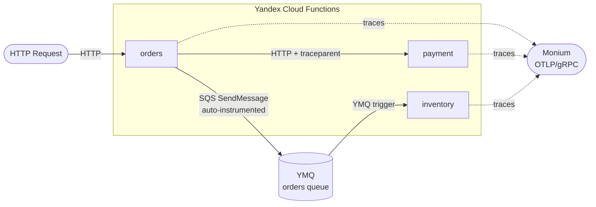

# OpenTelemetry Tracing with Yandex Cloud Monium

This example demonstrates distributed tracing across three Yandex Cloud Functions using OpenTelemetry, with traces exported to [Yandex Cloud Monium](https://yandex.cloud/ru/docs/monitoring/).

## Architecture



- **Orders** (`orders.ts`): Entry point. Receives an HTTP request, calls the payment service with W3C trace context propagation, publishes an order event to YMQ, and returns the order ID with trace ID.
- **Payment** (`payment.ts`): Called by the orders service via HTTP. Simulates payment processing and returns a response with the shared trace ID.
- **Inventory** (`inventory.ts`): Triggered by YMQ messages. Consumes order events and reserves inventory, creating child spans under the originating trace.
- **Tracing** (`tracing.ts`): Shared module that initializes the OpenTelemetry SDK with an OTLP/gRPC exporter targeting Monium, registers AWS SDK auto-instrumentation, and provides `withTracing` / `withMqTracing` handler wrappers.
- **Client** (`client.ts`): Local script for manual end-to-end testing. Calls the orders function and prints the response.

## Features

- Distributed tracing across three serverless functions and a message queue
- W3C TraceContext propagation via HTTP headers (orders → payment)
- AWS SDK auto-instrumentation via `@opentelemetry/instrumentation-aws-sdk` (YMQ publish/consume)
- API Key–based authentication to Monium, stored securely in Yandex Lockbox
- Automatic span flush before each function response
- Dead-letter queue for failed order messages

## Prerequisites

- Yandex Cloud account with Monium enabled
- Terraform >= 1.0
- Node.js >= 18
- Go (for running tests)

## Project Structure

```text
otel/
├── README.md
├── function/
│   ├── orders.ts          # Orders function handler (HTTP entry point)
│   ├── payment.ts         # Payment function handler (HTTP, called by orders)
│   ├── inventory.ts       # Inventory function handler (YMQ trigger)
│   ├── tracing.ts         # Shared OpenTelemetry setup and handler wrappers
│   ├── client.ts          # Local test client script
│   ├── package.json
│   └── tsconfig.json
├── tf/
│   ├── terraform.tf       # Provider configuration
│   ├── variables.tf       # Input variables
│   ├── iam.tf             # Service accounts and IAM bindings
│   ├── lockbox.tf         # Lockbox secret storing the Monium API key
│   ├── mq.tf              # YMQ orders queue and dead-letter queue
│   ├── main.tf            # Function resources, trigger, and public bindings
│   └── outputs.tf         # Function IDs, URLs, and queue URL
└── environment/
    └── terraform.tfstate
```

## Deployment

### 1. Configure Variables

Create `tf/terraform.tfvars`:

```hcl
cloud_id  = "your-cloud-id"
folder_id = "your-folder-id"
```

### 2. Deploy

```bash
cd tf
terraform init
terraform apply
```

This will:

1. Build the TypeScript code (`npm ci && npm run build`)
2. Package the compiled code with dependencies
3. Create a Lockbox secret with the Monium API key
4. Create the YMQ orders queue and a dead-letter queue
5. Deploy three functions sharing a single service account
6. Create a YMQ trigger that invokes the inventory function
7. Make the orders and payment functions publicly accessible

## Usage

Invoke the orders function:

```bash
curl https://functions.yandexcloud.net/<orders_function_id>
```

Response:

```json
{
  "message": "Order placed",
  "orderId": "order-1712345678901",
  "traceId": "abc123...",
  "paymentResponse": {
    "message": "Callee processed successfully",
    "traceId": "abc123..."
  }
}
```

All three services share the same `traceId`, confirming distributed trace propagation through HTTP and YMQ.

### Local Testing with the Client Script

```bash
cd function
cp .env.example .env  # fill in ORDER_URL, MONIUM_API_KEY, FOLDER_ID
npm run client
```

## How It Works

1. The **orders** function receives an HTTP request and calls `withTracing`, which initializes OpenTelemetry and creates a root `handle-request` server span.
2. It opens a child `invoke-payment-service` client span and calls the **payment** function, injecting the W3C `traceparent` header.
3. The **payment** function extracts the trace context from the incoming headers, creating a child span under the same trace.
4. The **orders** function then publishes a message to YMQ via the AWS SDK. `AwsInstrumentation` automatically creates an SQS span for this call.
5. The YMQ trigger fires the **inventory** function, which calls `withMqTracing` to wrap all message processing in a `process-messages` consumer span.
6. All three functions export their spans to Monium via OTLP/gRPC before returning.

### Monium Connection Details

| Parameter | Value |
|-----------|-------|
| Endpoint | `ingest.monium.yandex.cloud:443` |
| Protocol | OTLP/gRPC with TLS |
| Auth | `Authorization: Api-Key <MONIUM_API_KEY>` |
| Project header | `x-monium-project: folder__<folder_id>` |
| Required role | `monium.traces.writer` |

The API key is generated for a dedicated `otel-monium-sa` service account and stored in Yandex Lockbox. Functions read it at runtime via the Lockbox secrets injection.

### Service Accounts

| Service account      | Roles                                     |
| -------------------- | ----------------------------------------- |
| `otel-monium-sa`     | `monium.traces.writer`                    |
| `otel-function-sa`   | `lockbox.payloadViewer`, `ymq.writer`     |
| `otel-mq-admin-sa`   | `ymq.admin` (queue provisioning only)     |
| `otel-mq-trigger-sa` | `ymq.reader`, `functions.functionInvoker` |

## Cleanup

```bash
cd tf
terraform destroy
```
